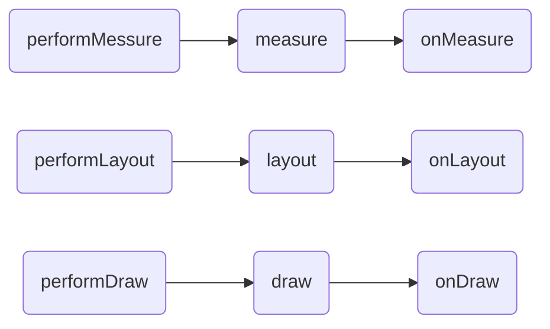

# 自定义View  
##[View测量、布局及绘制原理](https://www.jianshu.com/p/3d2c49315d68)
- ### 流程框架

* ###  Measure流程(测量控件大小)
    调用measure()方法，进行一些逻辑处理，然后调用onMeasure()，在onMeasure()中调用setMeasuredDimension()保存宽高信息，完成测量。  

    MeasureSpec是32位的int值，高2位表示测量模式(mode)，低两位表示测量值(size)。测量模式分为3类：  
    >  UNSPECIFIED:无限制模式  
    >  EXACTLY:精确测量模式  
    >  AT_MOST:给定最大值。View的大小不能大于父容器的大小   
    
    [如何确定MeasureSpec的值？](https://www.jianshu.com/p/1dab927b2f36)
* ### Layout流程

* ### 总结
    1. onMeasure()方法：单一View，一般重写此方法，针对wrap_content情况，规定View默认的大小值，避免于match_parent情况一致。ViewGroup，若不重写，就会执行和单子View中相同逻辑，不会测量子View。一般会重写onMeasure()方法，循环测量子View。
    2. onLayout()方法:单一View，不需要实现该方法。ViewGroup必须实现，该方法是个抽象方法，实现该方法，来对子View进行布局。
    3. onDraw()方法：无论单一View，或者ViewGroup都需要实现该方法，因其是个空方法。
